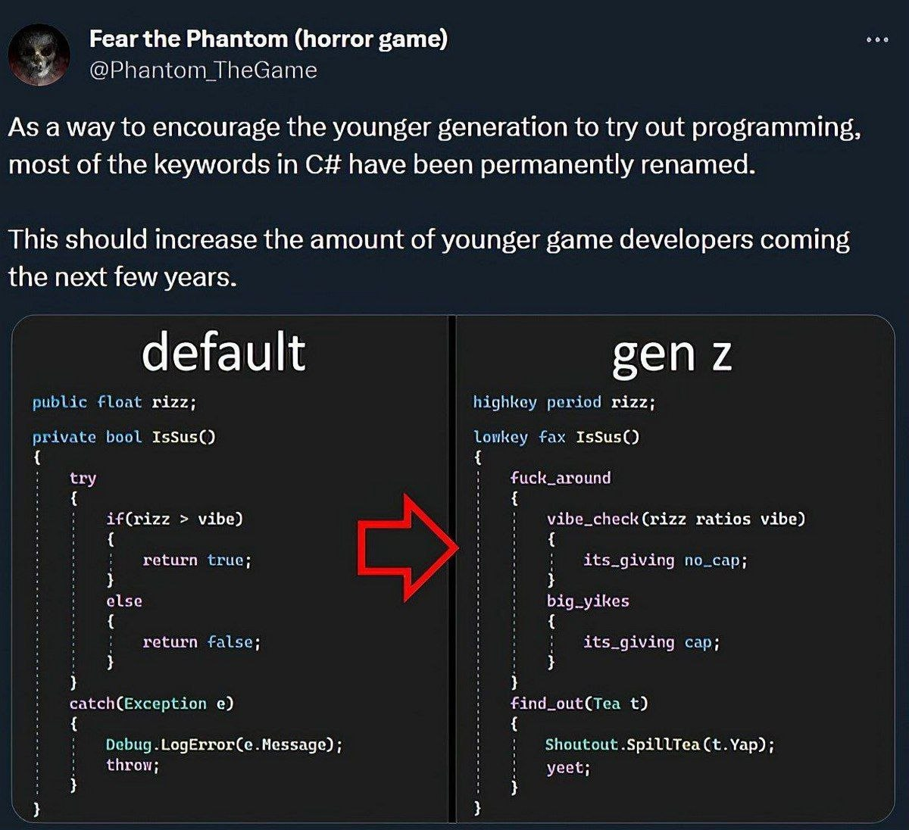

# GenZify
This project started after sharing this meme with a group of friends:

One of them dared me to 
>"something something be the change you want to see toussa"

Since I wanted to try vibe coding to see what the fuss it was all about, I downloaded the Void IDE and used Mistral and developped a tool that converts configured keywords into Java and vice-versa.

Just navigate to [https://vfxone.github.io/genzify/](https://vfxone.github.io/genzify/) to try the project out!